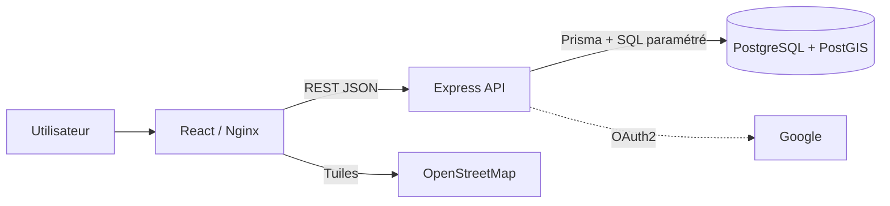
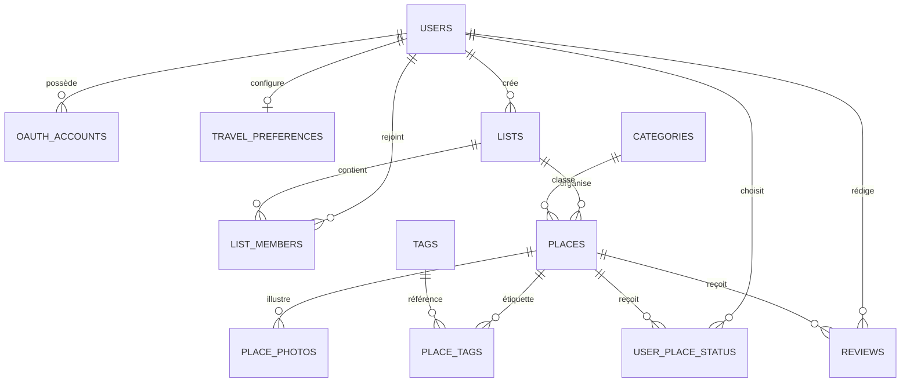

# Documentation technique SUPSTAR

## 1. Architecture

SUPSTAR utilise trois services distincts conformément au cahier des charges.



Le navigateur ne communique jamais directement avec PostgreSQL. La logique métier, les contrôles de rôle, la validation, les recherches et les imports sont exécutés côté API. Le client sert d'interface et transmet les requêtes.

### Technologies

| Couche | Technologies |
|---|---|
| Client | React 18, Vite, React Router, Axios, Leaflet |
| API | Node.js, Express, Prisma, JWT, bcrypt, Passport |
| Données | PostgreSQL 16, PostGIS 3.4 |
| Déploiement | Docker Compose, Nginx |

## 2. Backend

Le backend suit une séparation routes → middlewares → contrôleurs → services → accès aux données.

- `routes/` expose les ressources REST.
- `middleware/` authentifie le JWT, contrôle les rôles, limite les tentatives et centralise les erreurs.
- `controllers/` valide les entrées et produit les réponses HTTP.
- `services/` contient les opérations métier et SQL géospatial.
- `lib/prisma.js` fournit un client Prisma unique.

Les erreurs API utilisent la forme stable suivante :

```json
{ "error": { "message": "Description lisible" } }
```

## 3. Modèle de données

Les entités principales sont :

- `users`, `oauth_accounts`, `travel_preferences` ;
- `lists`, `list_members` ;
- `places`, `categories`, `tags`, `place_tags`, `place_photos` ;
- `user_place_status` ;
- `reviews`.

Un lieu appartient à une seule liste. Un utilisateur peut appartenir à plusieurs listes. Le statut est individuel grâce à la clé composée `(user_id, place_id)`. Un utilisateur ne peut publier qu'un avis par lieu.



### Rôles

| Action | Créateur | Éditeur | Commentateur | Lecteur |
|---|---:|---:|---:|---:|
| Lire la liste et les avis | Oui | Oui | Oui | Oui |
| Ajouter/modifier des lieux | Oui | Oui | Non | Non |
| Ajouter son avis | Oui | Oui | Oui | Non |
| Modérer les avis | Oui | Oui | Son avis | Non |
| Importer | Oui | Oui | Non | Non |
| Exporter | Oui | Oui | Oui | Oui |
| Gérer les membres | Oui | Non | Non | Non |

## 4. Géospatial et performances

`places.location` est une `GEOGRAPHY(Point, 4326)`. Les coordonnées sont construites avec `ST_MakePoint(longitude, latitude)` et restituées avec `ST_X`/`ST_Y`.

- index GiST sur `location` pour `ST_DWithin` et `ST_Distance` ;
- index GIN sur le vecteur de recherche français ;
- index sur liste, ville, catégorie, prix et statut ;
- limite de 500 résultats par liste ;
- clustering et rendu Canvas côté carte ;
- chargement différé des images et rendu progressif des groupes de marqueurs (`chunkedLoading`) ;
- recherche « autour de moi » limitée à 25 km dans l'interface ;
- toute requête géographique est limitée aux listes dont l'utilisateur est membre.

## 5. Notes et avis

La base contient un trigger recalculant `avg_rating` et `review_count` après chaque insertion, mise à jour ou suppression. Le service d'avis effectue aussi un recalcul dans la transaction afin de rendre l'état cohérent immédiatement et de rester robuste si le trigger est absent dans un environnement de test.

## 6. Import et export

Les exports JSON sont versionnés et contiennent la liste et ses lieux. Le CSV utilise une ligne par lieu avec les tags et photos séparés par `|`. Les champs contenant virgules, guillemets ou retours à la ligne sont échappés conformément au format CSV.

L'import est atomique : une transaction unique est validée uniquement si tous les lieux sont valides et enregistrés. Ainsi, une erreur sur une ligne ne laisse aucune donnée partielle. L'import :

1. limite la requête à 5 Mo et 500 lieux ;
2. parse l'intégralité du fichier ;
3. valide noms et coordonnées avant la création ;
4. crée au besoin les catégories ;
5. importe tags, photos, statut et avis personnel.

## 7. Sécurité

- bcrypt facteur 12 ;
- mot de passe de 8 à 128 caractères ;
- JWT signé et expirant ;
- protection OAuth2 `state` par valeur aléatoire et cookie `HttpOnly` ;
- jeton OAuth transmis dans le fragment URL, absent des requêtes HTTP et des en-têtes Referer ;
- limitation des tentatives de connexion ;
- CORS limité à `CLIENT_URL` ;
- corps JSON limité à 5 Mo ;
- SQL géospatial paramétré ;
- contrôles d'adhésion et de rôle côté serveur ;
- en-têtes `nosniff`, anti-frame, referrer et permissions ;
- secrets injectés par environnement et exclus de Git/Docker ;
- clés étrangères avec suppression en cascade ou mise à `NULL` contrôlée.

En production, servir uniquement en HTTPS, utiliser un secret JWT aléatoire, un mot de passe DB unique, restreindre le port PostgreSQL et configurer des sauvegardes du volume.

## 8. Conteneurs

- `db` initialise `schema.sql` uniquement sur un volume neuf ;
- `api` attend le healthcheck PostgreSQL et s'exécute avec l'utilisateur non privilégié `node` ;
- l'image API installe OpenSSL avant la génération du moteur Prisma ;
- `web` compile React puis sert les fichiers avec Nginx ;
- Nginx redirige `/api` vers Express et toutes les routes applicatives vers `index.html`.

## 9. Tests et maintenance

`npm test` exécute :

- tests unitaires du parseur CSV ;
- parcours d'intégration réel contre PostgreSQL/PostGIS ;
- isolation des données géographiques entre listes ;
- contrôles des rôles lecteur/commentateur ;
- rejet d'import sans écriture partielle ;
- validation des filtres numériques.

Le build frontend valide la transformation JSX et la production des assets. Pour une CI, exécuter PostgreSQL/PostGIS, `npm ci`, les tests backend puis le build frontend.

## 10. Limites connues

- OAuth Google nécessite des identifiants appartenant au déployeur ;
- les photos externes restent référencées par URL et les photos importées sont stockées dans le volume Docker `supstar_uploads`, avec contrôle du type, de la signature et d’une taille maximale de 8 Mo ;
- l'itinéraire est délégué au moteur OSRM proposé par OpenStreetMap ;
- le déploiement public et son nom de domaine dépendent de l'infrastructure choisie.
